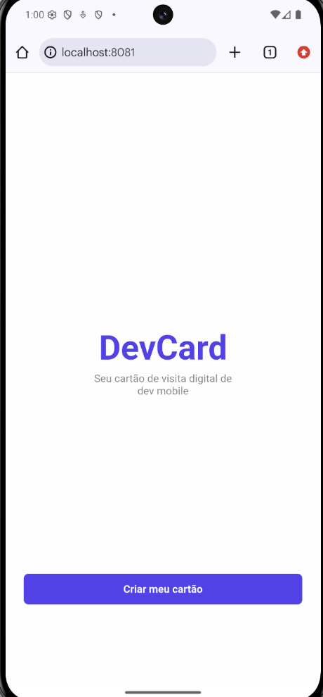
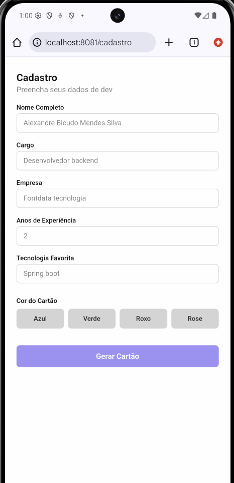
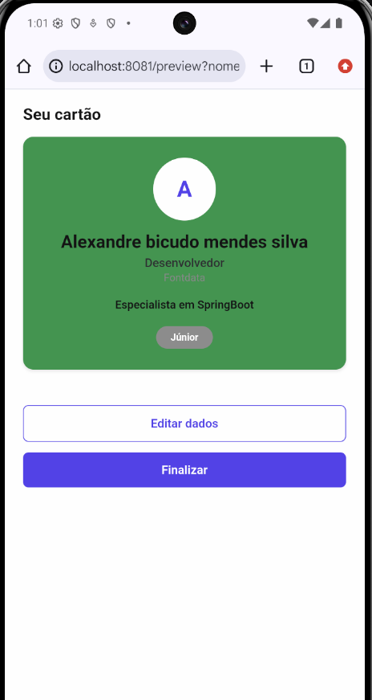
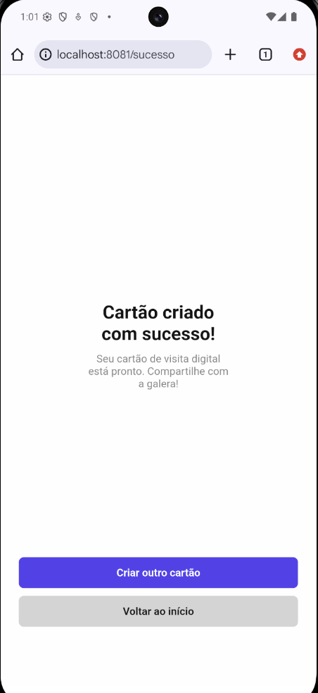

# DevCard App

Aplicativo de cartão de visitas digital para desenvolvedores, desenvolvido como atividade prática de React Native com Expo.

## Telas do Aplicativo

### 1. Tela de Boas-vindas
Tela inicial de apresentação do aplicativo com um botão para iniciar a criação do cartão.

### 2. Tela de Cadastro
Formulário para o usuário inserir seus dados profissionais (nome, cargo, empresa, anos de experiência, tecnologia e cor do cartão) com validação de campos obrigatórios.

### 3. Tela de Preview
Renderização do cartão de visitas estilizado de acordo com os dados preenchidos e a cor escolhida. Inclui uma badge que calcula o nível de experiência do dev (Júnior, Pleno ou Sênior).

### 4. Tela de Sucesso
Tela final de confirmação informando que o cartão foi gerado com sucesso.

## Tecnologias

- React Native
- Expo Router
- TypeScript
